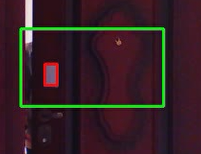

## 基于霍夫变换的家庭入侵检测系统(本科毕业设计)

### 介绍

---

我的本科毕业设计，手敲代码

详细文档，参考文件： `doc/基于霍夫变换的家庭入侵检测系统.pdf` (有点乱)


### 开始

---

1. **在现实世界中的准备工作：**  电脑Windows环境, 要有一个摄像头，把它对准**你房间的门** ，然后，在 
门沿上贴上一张矩形的**标签纸**（A5或A6），它和周围颜色的对比度必须很高，
参考下面第一张图里**红色**位置的这片白色标签纸，它被用来检测边缘；

2. 下载 `输出` 文件夹，放在任意位置即可，进入到里面；

4. 运行 `HomeMonitor.exe`, 摄像头无误后，会出现这样的选项：
```aiignore
未找到默认ROOT目录：G:\HomeMonitor
请手动输入ROOT目录:：
```
输入`HomeMonitor`， 这个文件夹就是工作目录；
4. 先把门关上， 在camera窗口里框选待监测范围， 比如框选出下面**绿色**的框 (你操作的时候是蓝色），这个框必须能框柱**标签纸**的活动范围，
门打开或关闭时，标签纸不能超出绿色框（门完全打开可以超出）



确认：`y`（这里固定有bug，出现`错误指令`）， 在命令行里输入命令`dm range`， 来重新框选绿色框，确认：`y`。然后程序会自动识别标签纸的初始位置


对其满意，就可以在命令行里的`是否选择该矩形为标记初始位置?`  输入`y`确认一下，然后监督就开始了；

5. 后面的很多细节看pdf文档里面写的吧，很多我都忘了


### 各种命令

---

1. `help`

2. `save`    `quit`  `start/stop/reload`   控制程序流程的，自己试试

3. `param`  这个命令会打印出程序所有参数值，仅用来查看。 有这几个模块 （`param help`）：
```aiignore
   global parameters           (global/g)
   camera parameters           (camera/cam)
   door moniter parameters     (door_moniter/dm)
   face detector parameters    (face_detector/fd)
   event ctrl parameters       (event_ctrl/ec)
```
4. `set {模块简写} {参数名简写} {参数值}`   
这个命令用来设置参数， 参数名简写是param里各参数括号里面的，比如`ID (id) ` 设备号的简写就是`id`

例子：


```aiignore
# 摄像头亮度调暗
set cam b -40

# 摄像头亮度调亮
set cam b 20

# 设置高斯模糊方差
set dm blur_sigma 1.1

# 宽边识别的最大角度偏差 40度
set dm w_angle_deviation 40

# 搜索窗口的比例系数
set fd scale_factor 1.2
```

**BUG**, 有一些问题没解决，比如`Global params`的参数简写没加, `event ctrl parameters`的参数显示和设置有问题。


5. **door_moniter 标签纸和房门的检测模块**  `dm help`  看看有哪些命令， 比如：
```aiignore
# 设置标记活动范围，识别标记，开始监测
# 注意，你可以反复框选蓝色矩形框直到满意， 最后在命令行里确认y
dm range

# 显示捕捉到的边缘直线
dm show lines

# 显示标记的初始位置
dm show org

# 保存的视频画面里将会带有线条、框，这些元素在里面
dm save

# 打印该模块的各种设置情况
dm configures
```
其它命令自己试试就知道了

6. **face_detector 人脸识别模块**  `dm help`看看有哪些命令， 比如：
```aiignore
#输入后，开始检测人脸
fd test

# 没实现，忽略这个吧
fd face++ 
```

7. **event_control 事件控制模块**
用来监测各种实际事件情况的， 比如：
   1. 出门事件
   2. 回家事件
   3. 忘关房门事件
   4. 入侵事件

该命令有BUG， 如果你有需要，请在**Issues**
向我提出问题， 然后我来把代码改改

---

To be continued...